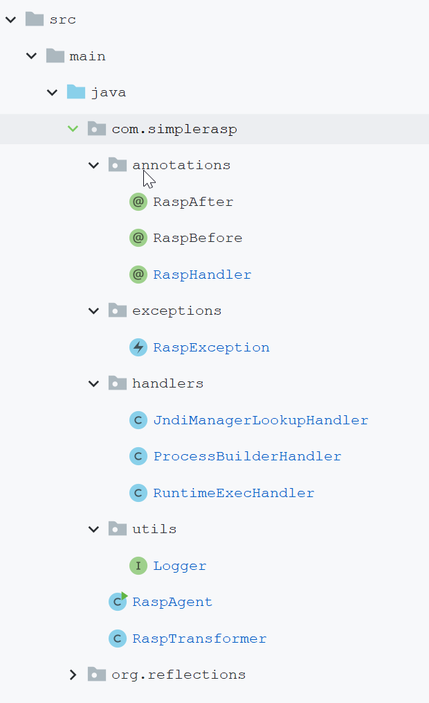

# SimpleRasp源码阅读学习

# 一、缘起

在GitHub搜索RASP关键词搜索到的项目

# 二、整体架构

整体架构非常简单，只有展开的这些代码是属于SimpleRasp：



## Rasp Handler

Rasp Handler是SimpleRasp的核心概念，相对应的在annotations下定义了三个Rasp相关的注解，这三个注解是面向Rasp拦截业务的，让Rasp能够有扩展能力，要增加Rasp的防御方法的话： 

1. 定义一个类，在Class添加@RaspHandler注解，使用注解的参数声明要Hook的类、方法、参数，是否是构造方法之类的（因为用到的javassist库要区分成员方法还是构造方法）
2. 在方法上添加@RaspBefore或者@RaspAfter，表示在被Hook的方法之前还是之后插入

接下来来看handlers包下的几个已经实现的防御，这几个都比较简单易懂，只看一个应该就懂了，可以看到这个方法在@RaspHandler上指定了要hook的方法是`org.apache.logging.log4j.core.net.JndiManager.lookup(String.class)`，要注入在这个方法之前的方法是handleBefore，因为JNDI注入必须得在连接之前拦截掉，只是方式比较简单粗暴（看了下其它的RASP的JNDI拦截似乎也是关键字包含，就是黑名单列表全一些...）：

```java
package com.simplerasp.handlers;

import com.simplerasp.annotations.RaspBefore;
import com.simplerasp.annotations.RaspHandler;
import com.simplerasp.exceptions.RaspException;

/**
 * 这个是用来防止jndi注入的
 */
@RaspHandler(className = "org.apache.logging.log4j.core.net.JndiManager", methodName = "lookup", parameterTypes = {String.class})
public class JndiManagerLookupHandler {

    @RaspBefore
    public static Object[] handleBefore(Object obj, Object[] params) {
        System.out.println("before");

        String name = (String) params[0];
        String[] blacklist = new String[]{"ldap", "jndi"};
        for (String s : blacklist) {
            if (name.toLowerCase().contains(s)) {
                throw new RaspException("Reject malicious jndi lookup attempt");
            }
        }
        return params;
    }

}
```

再来看一下@RaspAfter的例子，这个例子并不是很合适，只是这个after的想法值得探讨一下，比如它这里认为Runtime.exec可能就只是为了`cat /etc/passwd`，所以在我再before里不太好判断并且先执行一下也没什么大不了的（显然命令执行不属于），那么我就可以通过在返回的时候判断是否有敏感内容： 

```java
package com.simplerasp.handlers;

import com.simplerasp.annotations.RaspAfter;
import com.simplerasp.annotations.RaspBefore;
import com.simplerasp.annotations.RaspHandler;
import com.simplerasp.exceptions.RaspException;
import sun.misc.IOUtils;

/**
 * 命令注入
 */
@RaspHandler(className = "java.lang.Runtime", methodName = "exec", parameterTypes = {String.class})
public class RuntimeExecHandler {

    @RaspBefore
    public static Object[] handleBefore(Object obj, Object[] params) {
        System.out.println("before");

        String cmd = (String) params[0];
        System.out.println("try to exec: " + cmd);
        if (cmd.contains("Calculator")) {
            throw new RaspException("Reject malicious command execution attempt");
        }
        return params;
    }

    @RaspAfter
    public static Object handleAfter(Object obj, Object result) throws Exception {
        System.out.println("after");

        Process p = (Process) result;
        // 这么头铁的嘛，JDK不对直接就报错了吧...这兼容性基本没考虑啊...
        String output = new String(IOUtils.readAllBytes(p.getInputStream()));
        // 人家不一定非得是读取/etc/passwd啊老铁...
        if (output.contains("uid=")) {
            throw new RaspException("Reject malicious command execution output");
        }
        return result;
    }

}
```

## RaspAgent & RaspTransformer

这一部分就没什么好看的，就是为了注入代码，代码有点糙不分析了...

# 三、个人认为一些可以改进的点 

## RaspAgent中的retransform

每个@RaspHandler都会触发一次retransform，并且添加一个RaspTransformer，性能之类的难顶啊兄弟...

## 通用性与可配置参数

1. 一些模块的关键词之类的不适合写死在代码里，更好的方式是配置一个web界面来配置之类的
2. 同时如果Handler之间有类似的模式的话也许应该抽象一下，做成类似配置的方式，而不是每个都搞一个Handler，这种搞多了对JVM也是浪费

# 四、结论

代码整体结构比较简单易懂，比较适合刚入门RASP作为demo学习，但是离能够用在生产环境还差很远，兼容性和成熟度都还有比较大的发展【潜力】。


